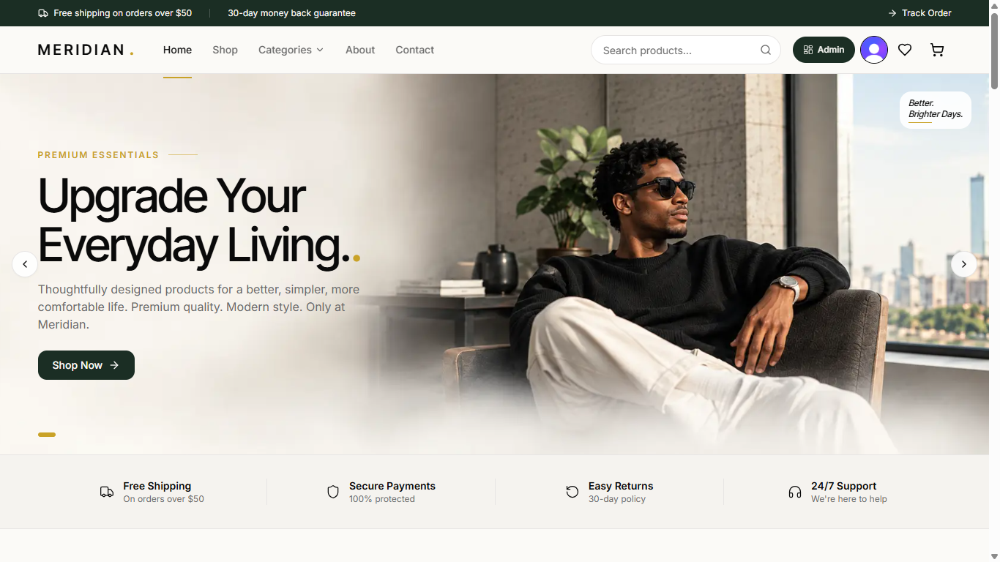
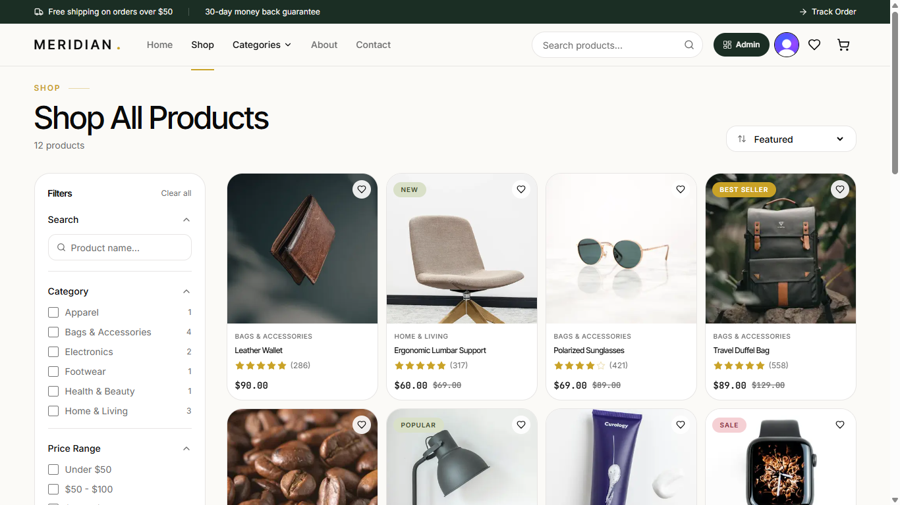
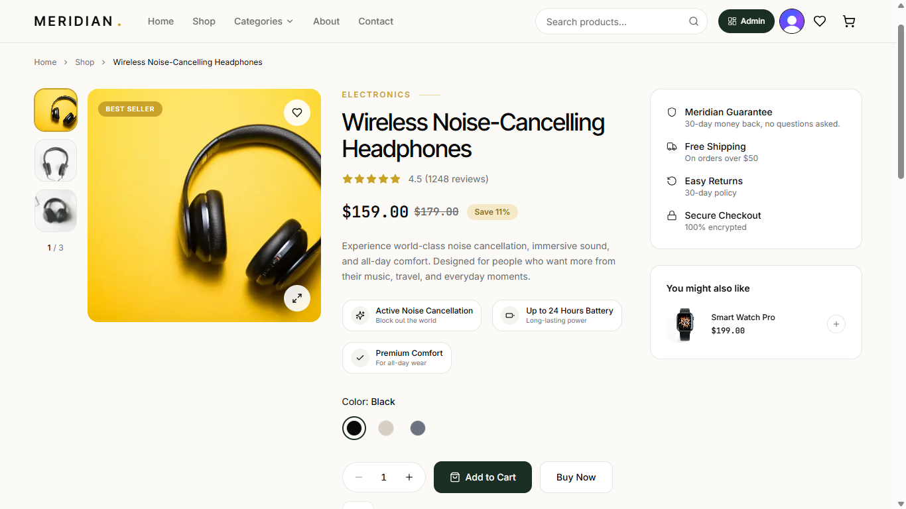
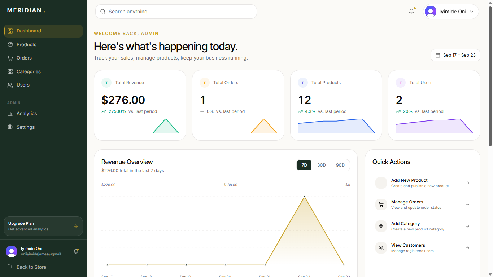

# Meridian

A production-grade, full-stack e-commerce platform built with Next.js 14, Prisma, and Stripe. Meridian ships as a single codebase containing two distinct applications: a customer-facing storefront and an owner-facing admin dashboard.

[Live Demo](https://meridian-six-pi.vercel.app) · [Report Bug](../../issues) · [Request Feature](../../issues)

---

## Preview









---

## Table of Contents

- [About](#about)
- [Features](#features)
- [Tech Stack](#tech-stack)
- [Architecture](#architecture)
- [Project Structure](#project-structure)
- [Data Model](#data-model)
- [Getting Started](#getting-started)
- [Environment Variables](#environment-variables)
- [Available Scripts](#available-scripts)
- [Deployment](#deployment)
- [Design System](#design-system)
- [Third-Party Services](#third-party-services)
- [License](#license)

---

## About

Meridian is not a tutorial clone. It is an end-to-end commerce platform with real business logic, real payment processing, and a real administrative backend.

The application demonstrates:

- Full-stack architecture with Next.js App Router and React Server Components
- Relational data modeling with Prisma and PostgreSQL
- Session-based authentication and role-based access control
- Stripe Checkout integration with webhook-driven order creation
- Asset upload and delivery through Cloudinary
- Transactional email with React Email and Resend
- Runtime theming via CSS custom properties
- A complete admin dashboard with charts, tables, and CRUD across every entity

---

## Features

### Storefront

- **Home** — hero carousel, category showcase, best sellers, trust strip, newsletter signup
- **Shop** — product grid with URL-driven filtering, multi-field search, sorting, and pagination
- **Product Detail** — image gallery, variant selection, tabbed content, reviews, related products
- **Cart** — persistent, database-backed, with quantity controls and free-shipping progress
- **Checkout** — Stripe Checkout with shipping address collection and webhook confirmation
- **Wishlist** — save products for later, available from the navbar and cart page
- **Account** — overview, order history, order detail, profile, addresses, payment methods, notifications, help and support
- **About** and **Contact** — marketing pages with anchor-scroll navigation

### Admin Dashboard

- **Dashboard** — real-time KPIs with sparklines, revenue chart, order status donut, recent orders, top products
- **Products** — full CRUD, image upload to Cloudinary, badge and stock management
- **Categories** — full CRUD with product-count awareness and delete protection
- **Orders** — status workflow, editable customer info, editable shipping address, editable totals, CSV export
- **Customers** — list with order count, lifetime spend, and segmentation
- **Users** — role management with self-protection guards
- **Analytics** — revenue, orders, and customer metrics across 7 / 30 / 90 day ranges, sales by category, order value distribution
- **Settings** — store info, localization, preferences, appearance, maintenance mode, and a gated danger zone

### Platform

- **Role-based access control** — Clerk sessions plus Prisma role checks
- **Runtime theming** — 4 themes and a primary color picker that apply site-wide instantly
- **Maintenance mode** — hide the storefront from non-admins with one toggle
- **Auto-admin promotion** — emails listed in `ADMIN_EMAILS` are promoted on first sign-in
- **Transactional emails** — order confirmations rendered with React Email
- **SEO** — Next.js Metadata API, Open Graph tags, sitemap and robots
- **Accessibility** — semantic markup, focus states, keyboard navigation, `prefers-reduced-motion` support
- **Responsive** — mobile-first layouts tested from 320px through ultrawide

---

## Tech Stack

### Frontend

| Technology | Purpose |
|---|---|
| Next.js 14 (App Router) | Framework with React Server Components |
| React 18 | UI library |
| TypeScript | End-to-end type safety |
| Tailwind CSS | Utility-first styling |
| Framer Motion | Animations and transitions |
| Lucide React | Icon set |
| Sonner | Toast notifications |
| Zustand | Client state (cart, wishlist) |
| React Hook Form | Form state management |
| Zod | Runtime schema validation |

### Backend

| Technology | Purpose |
|---|---|
| Node.js | Runtime |
| Next.js Route Handlers | REST API layer |
| Prisma | ORM with type-safe queries |
| PostgreSQL (Neon) | Serverless relational database |
| Clerk | Authentication and session management |
| Stripe | Payment processing |
| Cloudinary | Image storage and CDN delivery |
| Resend | Transactional email delivery |
| React Email | Email template rendering |

### Tooling

| Technology | Purpose |
|---|---|
| ESLint | Linting |
| Prisma Studio | Database GUI |
| Stripe CLI | Local webhook forwarding |
| Vercel | Hosting and deployment |

---

## Architecture

### Route Groups

The application uses Next.js route groups to separate three distinct experiences without affecting URLs:

```
app/
├── (store)/     Public storefront       /shop, /cart, /account
├── (admin)/     Protected dashboard     /admin/products, /admin/orders
└── (auth)/      Clerk-managed auth      /sign-in, /sign-up
```

Each group has its own layout, navigation shell, and access rules. The `(admin)` group wraps every page in a server-side role check that redirects non-admins before the page renders.

### Request Flow — Storefront

```
Browser
  → middleware.ts              (Clerk session check for protected routes)
  → app/(store)/layout.tsx     (fetch settings, categories, current user)
  → redirect to /maintenance   (if store is down and user is not admin)
  → page.tsx                   (Server Component)
  → prisma query
  → streamed JSX to client
```

### Request Flow — Checkout

```
Client POSTs /api/checkout
  → verify user is authenticated
  → verify cart is non-empty
  → verify user has at least one saved address
  → create Stripe Checkout Session with line items
  → return session.url
  → client redirects to Stripe

User completes payment
  → Stripe POSTs to /api/webhooks/stripe
  → verify signature
  → create Order and OrderItems in a transaction
  → clear CartItem rows
  → decrement Product.stock
  → send confirmation email via Resend
  → redirect user to /checkout/success
```

### Runtime Theming

The root layout reads a singleton `StoreSettings` row and generates a `<style>` tag with CSS custom properties. Every component references these tokens through Tailwind classes like `bg-background` and `text-foreground`. Changing the theme in the admin panel updates the settings row, revalidates the layout cache, and propagates the new theme to every page on the next request.

---

## Project Structure

```
meridian/
├── app/
│   ├── (store)/                        Storefront pages
│   │   ├── page.tsx                    Home
│   │   ├── shop/                       Product listing
│   │   ├── products/[slug]/            Product detail
│   │   ├── cart/                       Cart
│   │   ├── checkout/                   Checkout and success
│   │   ├── wishlist/                   Saved items
│   │   ├── about/ contact/             Marketing pages
│   │   └── account/                    Protected user area
│   ├── (admin)/admin/                  Admin dashboard
│   │   ├── page.tsx                    Dashboard
│   │   ├── products/                   Product management
│   │   ├── categories/                 Category management
│   │   ├── orders/                     Order management
│   │   ├── customers/                  Customer list
│   │   ├── users/                      User management
│   │   ├── analytics/                  Performance metrics
│   │   ├── marketing/                  Campaign views
│   │   └── settings/                   Store settings
│   ├── (auth)/                         Clerk sign-in and sign-up
│   ├── api/                            Route handlers
│   │   ├── admin/                      Admin-only endpoints
│   │   ├── auth/me/                    Current user role
│   │   ├── cart/                       Cart operations
│   │   ├── wishlist/                   Wishlist operations
│   │   ├── checkout/                   Stripe session creation
│   │   ├── webhooks/stripe/            Stripe webhook handler
│   │   ├── addresses/                  Address CRUD
│   │   ├── payment-methods/            Payment method CRUD
│   │   ├── notifications/              Notification management
│   │   └── support/                    Contact form
│   ├── maintenance/                    Maintenance page
│   ├── layout.tsx                      Root layout with theme injection
│   └── globals.css                     Theme tokens and base styles
├── components/
│   ├── store/                          Storefront components
│   ├── admin/                          Admin components
│   ├── auth/                           Auth wrappers
│   └── shared/                         Cross-cutting primitives
├── lib/
│   ├── prisma.ts                       Prisma client singleton
│   ├── auth.ts                         getCurrentUser and admin guard
│   ├── stripe.ts                       Stripe client
│   ├── cloudinary.ts                   Upload helper
│   ├── resend.ts                       Email client
│   ├── settings.ts                     StoreSettings access
│   ├── themes.ts                       Theme tokens
│   ├── utils.ts                        Shared helpers
│   ├── constants.ts                    Site config and navigation
│   ├── fonts.ts                        next/font setup
│   └── queries/                        Server-side data access
├── hooks/                              React hooks
├── prisma/
│   ├── schema.prisma                   Database models
│   └── seed.ts                         Seed data
├── emails/                             React Email templates
├── scripts/                            Utility scripts
├── public/                             Static assets
├── middleware.ts                       Clerk route protection
└── tailwind.config.ts                  Design tokens
```

---

## Data Model

Fourteen Prisma models in `prisma/schema.prisma`:

| Model | Purpose |
|---|---|
| `User` | Clerk-synced users with role and notification preferences |
| `Product` | Catalog items with images, variants, stock, and badge |
| `Category` | Product groupings |
| `Order` | Placed orders with totals and shipping address |
| `OrderItem` | Snapshot of products at order time |
| `CartItem` | Per-user cart rows |
| `WishlistItem` | Per-user wishlist rows |
| `Address` | Saved shipping and billing addresses |
| `Review` | Product reviews |
| `Notification` | User notification inbox |
| `PaymentMethod` | Saved card references (brand and last four digits only) |
| `ContactMessage` | Support form submissions |
| `StoreSettings` | Singleton configuration row |
| `NewsletterSubscriber` | Newsletter signups |

All tables use lowercase plural naming via `@@map()` for clean SQL output.

---

## Getting Started

### Prerequisites

- Node.js 18 or later
- A Neon account (free PostgreSQL database)
- A Clerk account (authentication)
- A Stripe account (test mode is sufficient)
- A Cloudinary account (image hosting)
- A Resend account (email delivery)

### Installation

```bash
git clone https://github.com/Tempest-Ltd/meridian.git
cd meridian
npm install
```

### Database Setup

```bash
npx prisma db push
npx prisma generate
npm run db:seed
```

### Run the Development Server

```bash
npm run dev
```

Open `http://localhost:3000`.

### Local Webhook Setup

Stripe webhooks need to reach your local environment. In a separate terminal:

```bash
stripe listen --events checkout.session.completed --forward-to localhost:3000/api/webhooks/stripe
```

Copy the printed `whsec_...` value into `.env.local` as `STRIPE_WEBHOOK_SECRET`, then restart the dev server.

---

## Environment Variables

Create `.env.local` in the project root:

```env
# Database
DATABASE_URL="postgresql://...-pooler...neon.tech/neondb?sslmode=require"
DIRECT_URL="postgresql://...neon.tech/neondb?sslmode=require"

# Clerk
NEXT_PUBLIC_CLERK_PUBLISHABLE_KEY="pk_test_..."
CLERK_SECRET_KEY="sk_test_..."
NEXT_PUBLIC_CLERK_SIGN_IN_URL="/sign-in"
NEXT_PUBLIC_CLERK_SIGN_UP_URL="/sign-up"
NEXT_PUBLIC_CLERK_AFTER_SIGN_IN_URL="/account"
NEXT_PUBLIC_CLERK_AFTER_SIGN_UP_URL="/account"

# Stripe
NEXT_PUBLIC_STRIPE_PUBLISHABLE_KEY="pk_test_..."
STRIPE_SECRET_KEY="sk_test_..."
STRIPE_WEBHOOK_SECRET="whsec_..."

# Cloudinary
CLOUDINARY_CLOUD_NAME="..."
CLOUDINARY_API_KEY="..."
CLOUDINARY_API_SECRET="..."

# Resend
RESEND_API_KEY="re_..."
RESEND_FROM_EMAIL="onboarding@resend.dev"

# Application
NEXT_PUBLIC_APP_URL="http://localhost:3000"

# Comma-separated emails auto-promoted to admin on first sign-in
ADMIN_EMAILS="you@example.com"
```

All required variables are documented in `.env.example`.

---

## Available Scripts

| Command | Description |
|---|---|
| `npm run dev` | Start the development server |
| `npm run build` | Build for production |
| `npm run start` | Run the production build |
| `npm run lint` | Run ESLint |
| `npm run db:seed` | Seed the database with sample data |
| `npm run db:studio` | Open Prisma Studio |
| `npm run make-admin -- <email>` | Promote a user to admin |
| `npx prisma db push` | Sync schema to the database |
| `npx prisma generate` | Regenerate the Prisma client |

---

## Deployment

Meridian is designed to deploy on Vercel with a Neon PostgreSQL database.

1. Push the repository to GitHub
2. Import the repository in Vercel
3. Add every environment variable from `.env.local` to Vercel's project settings
4. Update `NEXT_PUBLIC_APP_URL` to the production domain
5. Register a production webhook in Stripe pointing to `https://your-domain.vercel.app/api/webhooks/stripe` for the `checkout.session.completed` event
6. Add the webhook signing secret to Vercel as `STRIPE_WEBHOOK_SECRET`
7. Deploy

The application stays in Stripe test mode by design. All payment flows work identically to live mode using the test card `4242 4242 4242 4242`.

---

## Design System

Meridian uses a token-based design system driven by CSS custom properties.

- **Themes** — Light, Dark, Forest, and Minimal, each a complete token map
- **Primary color** — Configurable accent applied to buttons, links, and focus rings site-wide
- **Typography** — Inter for body text, Inter Tight for display headings, JetBrains Mono for prices and numerals
- **Spacing** — Consistent 4px rhythm with generous section padding
- **Motion** — Framer Motion for page transitions and micro-interactions, with `prefers-reduced-motion` respected globally
- **Components** — Hand-rolled on top of Radix primitives; no heavy component library

---

## Third-Party Services

| Service | Purpose | Tier Used |
|---|---|---|
| [Neon](https://neon.tech) | Serverless PostgreSQL | Free |
| [Clerk](https://clerk.com) | Authentication and session management | Free |
| [Stripe](https://stripe.com) | Payment processing | Test mode |
| [Cloudinary](https://cloudinary.com) | Image storage and CDN delivery | Free |
| [Resend](https://resend.com) | Transactional email delivery | Free |
| [Vercel](https://vercel.com) | Hosting and deployment | Hobby |

---

## License

This project is a personal portfolio piece. Not licensed for commercial redistribution. See `LICENSE` for details.

---

Built by [Oni Iyimide James](https://github.com/Tempest-Ltd).